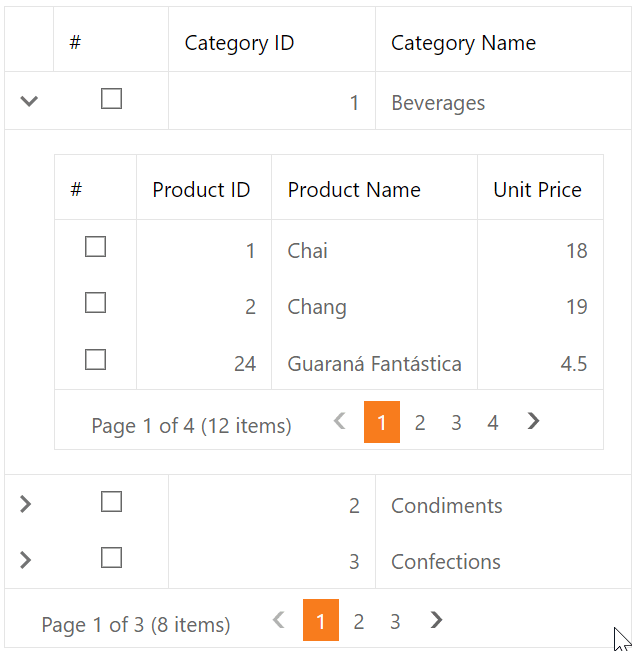

<!-- default badges list -->

[](https://supportcenter.devexpress.com/ticket/details/E355)
[](https://docs.devexpress.com/GeneralInformation/403183)
<!-- default badges end -->
# Grid View for ASP.NET Web Forms - Select detail rows on master row selection

This example demonstrates how to select or deselect rows in a detail grid when master row selection changes.



## Overview

Follow the steps below to implement master-detail functionality and select or deselect detail rows based on the master row's selection state:

1. Create a master grid control, set the [ShowDetailRow](https://docs.devexpress.com/AspNet/DevExpress.Web.ASPxGridViewDetailSettings.ShowDetailRow) property to `true`, specify the grid's [Templates.DetailRow](https://docs.devexpress.com/AspNet/DevExpress.Web.GridViewTemplates.DetailRow) property, and add a detail grid to the template. For both grid controls, set the [ShowSelectCheckbox](https://docs.devexpress.com/AspNet/DevExpress.Web.GridViewCommandColumn.ShowSelectCheckbox) property to `true` to enable selection.

    ```aspx
    <dx:ASPxGridView ID="master" runat="server" ...>
        <SettingsDetail ShowDetailRow="True" />
        <ClientSideEvents SelectionChanged="onMasterGridSelectionChanged" />
        <Columns>
            <dx:GridViewCommandColumn ShowSelectCheckbox="true" VisibleIndex="0" />
            <!-- ... -->
        </Columns>
        <Templates>
            <DetailRow>
                <dx:ASPxGridView ID="detail" runat="server" ...>
                    <Columns>
                        <dx:GridViewCommandColumn ShowSelectCheckbox="true" VisibleIndex="0" />
                        <!-- ... -->
                    </Columns>
                </dx:ASPxGridView>
            </DetailRow>
        </Templates>
    </dx:ASPxGridView>
    ```

2. Handle the master grid's client-side [SelectionChanged](https://docs.devexpress.com/AspNet/js-ASPxClientGridView.SelectionChanged) event. In the handler, send a callback to the server and pass the master row's visible index and the row's selection state as parameters.

    ```js
    function onMasterGridSelectionChanged(s, e) {
        master.PerformCallback("select|" + e.visibleIndex + "|" + (e.isSelected ? "T" : ""));
    }
    ```

3. Handle the master grid's server-side `CustomCallback` event. In the handler, do the following:

   * Call the master grid's [FindDetailRowTemplateControl](https://docs.devexpress.com/AspNet/DevExpress.Web.ASPxGridView.FindDetailRowTemplateControl(System.Int32-System.String)) method to access the detail grid.
   * Call the detail grid's [SelectAll](https://docs.devexpress.com/AspNet/DevExpress.Web.Data.WebDataSelection.SelectAll) or [UnselectAll](https://docs.devexpress.com/AspNet/DevExpress.Web.Data.WebDataSelection.UnselectAll) method to select or deselect detail grid rows based on the master row's selection state.

    ```csharp
    protected void master_CustomCallback(object sender, ASPxGridViewCustomCallbackEventArgs e) {		
		string[] data = e.Parameters.Split('|');
		if(data.Length == 3 && data[0] == "select")
			ProcessDetailSelection(int.Parse(data[1]), data[2] == "T");		
	}

	void ProcessDetailSelection(int index, bool state) {
		ASPxGridView detail = master.FindDetailRowTemplateControl(index, "detail") as ASPxGridView;
		if(detail != null) {
			if(state)
				detail.Selection.SelectAll();
			else
				detail.Selection.UnselectAll();
		}
	}
    ```

## Files to Review

* [Default.aspx](./CS/WebSite/Default.aspx) (VB: [Default.aspx](./VB/WebSite/Default.aspx))
* [Default.aspx.cs](./CS/WebSite/Default.aspx.cs) (VB: [Default.aspx.vb](./VB/WebSite/Default.aspx.vb))

## Documentation

* [Master-Detail Relationship](https://docs.devexpress.com/AspNet/3772/components/grid-view/concepts/master-detail-relationship)
* [Grid Selection](https://docs.devexpress.com/AspNet/3737/components/grid-view/concepts/focus-and-navigation/selection)
* [Grid View Templates](https://docs.devexpress.com/AspNet/3718/components/grid-view/concepts/templates)

## More Examples

* [Grid View for ASP.NET Web Forms - Simple master-detail implementation](https://github.com/DevExpress-Examples/asp-net-web-forms-grid-master-detail-implementation)
* [Grid View for ASP.NET Web Forms - How to update master and detail grids simultaneously in batch edit mode](https://github.com/DevExpress-Examples/asp-net-web-forms-grid-update-master-and-detail-grids-in-batch-mode)
* [Grid View for ASP.NET Web Forms - How to refresh a master grid on a detail grid callback](https://github.com/DevExpress-Examples/asp-net-web-forms-grid-refresh-master-grid-on-detail-grid-callback)
